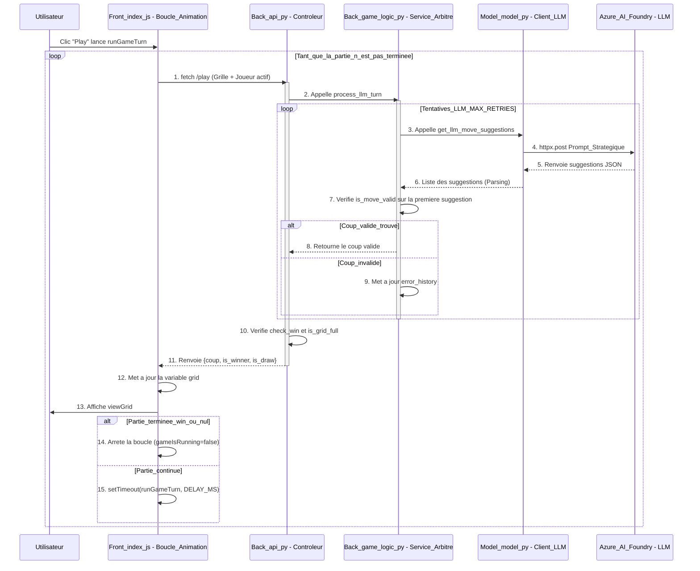

# tictactoe
Création d'un jeu du morpion IA vs IA

## Lien vers l'application

[TicTactoe - Déploiement AZ de Gaëtan](https://calm-desert-0e016c203.3.azurestaticapps.net)

[TicTactoe - Déploiement AZ de Nabil](https://zealous-stone-0b1da0103.3.azurestaticapps.net/)

## Objectif du projet

Faire affronter des LLM dans un jeu du morpion dans une grille 10x10. Le système gère l'alternance des tours, la validité des coups des LLM et l'affichage dynamique de la partie.

## Stack Technique

**Langage** : Python 3.12, Javascript.

**Back-end** : FastAPI (Serveur API Asynchrone), httpx (Client HTTP Asynchrone), Pydantic (Validation des données).

**Dépendances** : Poetry (Gestion des dépendances).

**Modèles IA** : Modèles de Azure IA Foundry - o4-mini & gpt-o4.

**Déploiement** : Docker (back-end) & Azure App Service.

## 2. Architecture et responsabilités

```
|- tictactoe/
|
|-- .env                     <- (Secrets) Clés API Azure et Endpoints en local
|-- .dockerignore            <- Fichiers à ignorer (inclut .env, .venv, Front/)
|-- Dockerfile               <- Instructions de build du Back-end
|-- pyproject.toml           <- Dépendances (Poetry)
|-- README.md                <- Documentation du projet
|
|-- Back/                    <- PAQUET PYTHON : Cœur du Service et de la Logique
|   |-- __init__.py          <- Marqueur de paquet
|   |-- api.py               <- Contrôleur FastAPI (@app.post("/play"))
|   |-- game_logic.py        <- Service : check_win, is_move_valid, process_llm_turn
|   |-- move_request.py      <- Modèle Pydantic (MoveRequest)
|
|-- Model/                   <- PAQUET PYTHON : Client LLM et Utilitaires IA
|   |-- __init__.py          <- Marqueur de paquet
|   |-- model.py             <- Classe LLMClient (Appel httpx, Authentification Multi-API, Prompting)
|
|-- Front/                   <- INTERFACE WEB (Déploiement Statique)
|   |-- index.html           <- Structure de la page et des boutons
|   |-- index.js             <- Logique du jeu JS (Boucle récursive, fetch, animation viewGrid)
|   |-- index.css            <- Styles
```


## Schématisation des responsabilités

### Front/index.js

- Affiche la grille ```viewGrid```
- Envoie la requête HTTP ```fetch``` quand on clique

### Back/api.py

- Gère le HTTP
- Reçoit la requête JSON, la valide grâce ```MoveRequest``` et délègue immédiatement le travail
- Il gère les erreurs finales (HTTP 500, 400...)

### Back/game_logic.py

- Contient la boucle de tentative ```process_llm_turn```
- Contient la logique de vérification des coups```is_move_valid```
- Contient la condition de victoire ``` check_win ```

### Model/model.py

- Construit les prompts (utilisation de ```format_grid_for_llm```)
- Appelle les modèles (httpx pour les requêtes pour l'aspect asynchrone)
- Parse la réponse JSON du LLM

## Schéma - Diagramme de séquence


