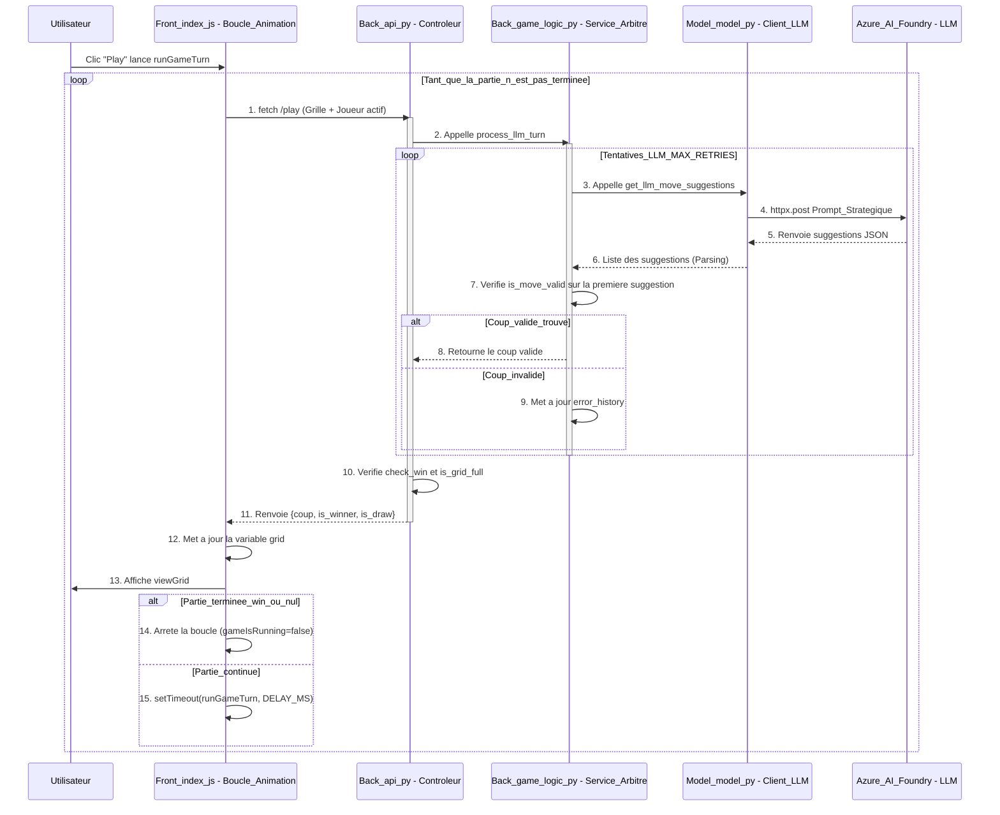

# PRÉSENTATION : LE CYCLE DE JEU DU MORPION IA VS IA

## 1. Démarrage du Cycle (Contrôle Front-end)

Le cycle de jeu est géré par la boucle JavaScript pour garantir l'animation.

* **Action Utilisateur :** Un clic sur "Play" désactive le bouton (`playButton.disabled = true`) et lance la fonction principale `runGameTurn` (dans `Front/index.js`).
* **Cycle Externe :** Le contrôle de la boucle est assuré par la récursivité asynchrone `setTimeout(runGameTurn, DELAY_MS)`. Ceci permet à l'affichage du navigateur de se rafraîchir après chaque coup.
* **Délégation API :** Le Front-end envoie l'état du jeu (`grid`, `activePlayerId`) via `fetch` vers l'endpoint `/play`.

## 2. Contrôle et Orchestration (Back-end)

La requête est traitée par le Contrôleur qui délègue la logique métier.

* **Validation d'Entrée :** Le module **`Back/api.py`** valide la requête grâce à **`MoveRequest`** (Pydantic).
* **Orchestration :** L'API appelle immédiatement la fonction **`process_llm_turn`** (dans `Back/game_logic.py`). Cette fonction démarre le cycle interne de fiabilité (`loop Tentatives`).

## 3. Le Cycle Interne

Le cœur de la logique gère la communication avec le modèle pour obtenir un coup valide.

* **Préparation du Prompt :** Le `LLMClient` (dans `Model/model.py`) appelle `format_grid_for_llm` pour convertir la matrice en un format tabulaire lisible par l'IA.
* **Appel Réseau :** Le `LLMClient` exécute l'appel `await client.post(...)` via **httpx** vers Azure AI Foundry, en s'authentifiant avec le `Bearer Token`.
* **Stratégie :** Le prompt injecte la **priorité défensive** (bloquer l'adversaire s'il a 4 en ligne) pour forcer un comportement intelligent.
* **Arbitrage :** Après le parsing de la réponse (`{"moves": [...]}`), le code vérifie la validité des suggestions (case vide, dans les limites) grâce à la fonction **`is_move_valid`** (dans `Back/game_logic.py`). Si un coup est invalide, le cycle interne (`MAX_RETRIES`) recommence.

## 4. Clôture du Tour et Mise à Jour Visuelle

Le serveur confirme le coup et le Front-end met à jour l'état.

* **Vérification de Fin de Partie :** Le Back-end applique le coup à une grille temporaire et vérifie les conditions d'arrêt : **`check_win()`** (victoire) ou **`is_grid_full()`** (match nul).
* **Réponse Finale :** L'API envoie le coup et le statut (`is_winner`, `is_draw`) au Front-end.
* **Animation et Relance :** Le Front-end met à jour la variable globale `grid`, appelle `viewGrid()` (pour afficher le coup), alterne l'ID du joueur, et relance la fonction `runGameTurn` via `setTimeout` pour le tour suivant.

## Schéma - Diagramme de séquence

